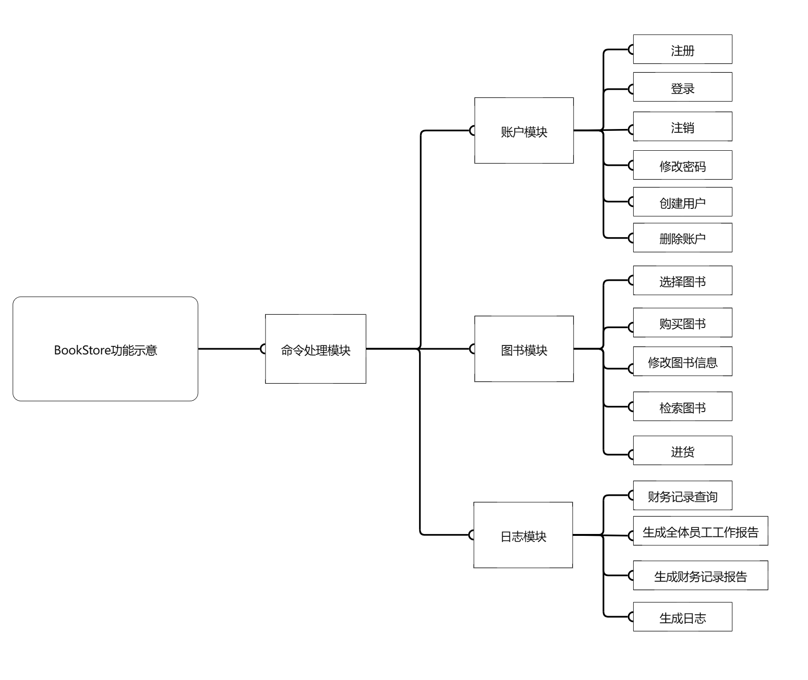
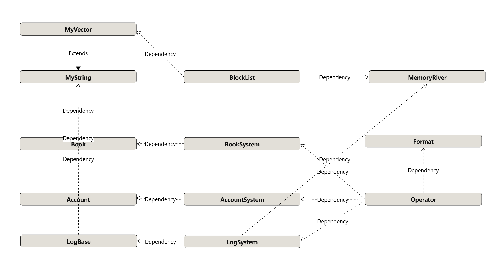

## 书店管理系统

By Boju Zhang

### 程序功能概述

实现一个简单的数点管理系统，采取命令行进行交互

实现简单的权限管理，登录/登出管理。

实现图书管理，通过 ISBN 编码作为主关键字对图书的基本信息，售价存量等销售信息存储，并提供查询，出售进货等操作。

维护简单的日志系统。

采取文件存储数据，因而支持反复启动。

注意：I/O 交互格式以 ```标准要求.md``` 为准。

### 主体逻辑说明

自顶向下讨论：主函数部分对 IO 交互进行处理，根据操作类别分到各个模块处理

命令处理模块：解析所有指令，分到后续各个模块处理

账户模块：包含登录、注册、创建用户、注销、修改密码、删除账户等操作。使用文件整体存储账户的用户名、密码、权限等信息。维护登录栈对这些操作进行模拟

图书模块：包含检索、购买、选择、修改图书信息、进货等操作。使用多个文件分关键字存储图书信息，并给每个图书增添唯一不可修改编号方便区分。

日志模块：包含财务记录查询、生成财务记录报告指令、生成全体员工工作情况报告指令、生成日志等操作。使用文件存储日志。

### 代码文件建构

```/doc/``` 目录下存储了本项目的文档

```/include/``` 目录下存储了本项目依赖的文件

```/src/``` 目录下存储了代码文件

```/src/``` 下包含 ```account.hpp, book.hpp, log.hpp, format.hpp, operator.hpp, main.cpp```，分别代表账户系统，图书系统，日志系统，命令处理系统，操作执行系统，主程序。

也包含 ```MemoryRiver.hpp, BlockList.hpp```，前者提供了对单文件存储一个类型的信息进行操作的基础，后者实现了一个块状链表，用于查找。

### 功能设计



### 数据库设计

对于账户信息，使用一个块状链表存储其所有信息，```key``` 为 ```UserID```，```value``` 为一整个 ```Account``` 类 。

对于图书信息，每本图书赋予额外的 ```id```，两两不同且唯一、不可变。

使用五个块状链表：

1. ```key``` 为 ```id```，```value``` 为一整个 ```Book``` 类

2. ```key``` 为 ```ISBN```，```value``` 为一整个 ```Book``` 类

3. ```key``` 为 ```BookName```，```value``` 为一整个 ```Book``` 类

4. ```key``` 为 ```AuthorName```，```value``` 为一整个 ```Book``` 类

5. ```key``` 为 ```Keyword```，```value``` 为一整个 ```Book``` 类

对于日志信息，一个普通文件记录财务信息，另一个块状链表记录日志信息。

财务信息记录收入支出前缀和，当前交易总量。

日志信息 ```key``` 为 ```time```，```value``` 为整个 ```Log``` 类

### 类，结构体设计

```MemoryRiver.hpp, BlockList.hpp```，前者实现了 ```MemorRiver``` 类，提供了单文件存储信息写入，更新，读取的操作；后者实现了 ```BlockList``` 类，利用块状链表实现键值对存储，并提供插入，删除，查找等操作。

```MyVector.hpp```: 基于 ```std::array``` 实现了一个行为类似 ```std::vector``` 的空间恒定的容器。

```account.hpp``` ：实现 ```Account``` 类，用于存储账户信息。实现 ```AccountSystem``` 类，用于执行有关账户的操作。

```book.hpp```：实现 ```Book``` 类，用于存储图书信息。实现 ```BookSystem``` 类，用于执行有关图书的操作。

```log.hpp```：实现 ```LogBase``` 类，作为日志内容的基类。实现基于操作不同的 ```Logxxx``` 类，作为具体的日志内容。实现 ```LogSystem``` 类，用于执行查询日志，添加日志的操作。

```format.hpp```：实现 ```Format``` 类，提供对命令的解析。

```operator.hpp```：实现```Operator``` 类，用于执行命令。

