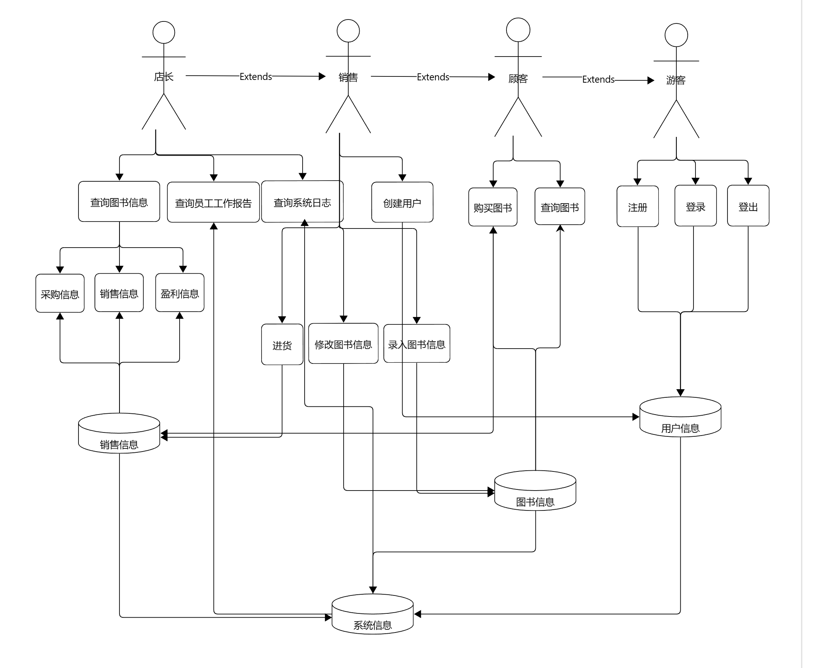

## BookStore 需求分析文档

### 业务流图


### 数据流图



### 数据词典

#### 图书信息

ISBN 编码：字符串， $20$ 个字符，唯一标识

书名：字符串，不超过 $60$ 个字符

作者 ：字符串，不超过 $60$ 个字符

关键字：一个或多个字符串，总共不超过 $60$ 个字符

库存量：非负整型

单价：非负实数

#### 销售信息

分为销售信息，采购信息

销售信息：销售书 ISBN 编码，盈利

采购信息：采购书 ISBN 编码，采购数量，采购价

盈利：实数

采购数量：正整数

采购价：非负实数

#### 用户信息

用户名：字符串，不超过 $60$ 个字符

密码：字符串，不超过 $20$ 个字符

权限：整数，具体地 $0,1,3,7$ 分别代表游客，顾客，销售，店长

#### 系统信息

存储操作日志

操作者：用户名

操作时间：非负整数

操作类型：注册用户，用户登录，用户登出，销售图书，采购图书，查询图书，修改图书信息，录入图书信息

### 功能说明

#### 登录模块

注册：注册账号，输入用户名，密码

登录：登录账号，输入用户名和密码

登出：登出当前账号

创建用户：输入初始权限，用户名，密码

#### 图书操作模块

购买图书：输入 ISBN 编码，购买数量

查询图书：输入查询信息，可以由 ISBN 编码，书名，作者，关键字构成

购入图书（进货）：输入 ISBN 编码，数量，进货价格

录入图书信息：输入 ISBN 编码，书名，作者，关键字，单价

修改图书信息：输入 ISBN 编码，新书名，作者，关键字，单价

#### 日志模块

查询采购信息：输入查询时间段，按照采购顺序输出采购图书的 ISBN 号、数量、单价等

查询盈利信息：输入查询时间段，输出该段时间的收入，支出以及利润

查询销售情况：输入查询时间段，按照销售顺序输出售出图书的 ISBN 号、数量、单价等

查询员工工作报告：输入员工用户名，按操作顺序输出每次操作类型及其对象

查询系统日志：输入查询时间段，输出这段时间内系统工作日志

#### 用户交互设计

#### 登录模块

注册：输入：```register [username] [password]```；输出：若成功输出：```Register Successfully [username]```，否则输出 ```Register Unsuccessfully```

登录：输入：```login [username] [password]```；输出：若成功输出：```Login Successfully [username]```，否则输出 ```Wrong Password or Username```

登出：输入：```logout```；输出 ```Logout Successfully```

创建用户：输入：```adduser [type] [username] [password]```；输出：若成功输出：```Adduser Successfully [username]```，否则输出 ```Adduser Unsuccessfully```

#### 图书操作模块

购买图书：输入：```buy [ISBN] [number]```；输出：若成功输出 ```Buy [ISBN] [number] Successfully```，否则输出```Don't Have Enough books```

查询图书：输入：```query ((-i [ISBN]) | (-a [author]) | (-n [bookname]) | (-k [keywords]))```；输出：若成功输出 ```ISBN: [ISBN] Name: [bookname] Author: [Author] Keywords:[keywords] Price:[price]```，否则输出```Cannot find the book```

购入图书（进货）：输入：```buyin [ISBN] [number]```；输出： ```Buyin Successfully```

录入图书信息：输入：```addbook [ISBN] [bookname] [author] [keywords] [price] ```；输出：若成功输出 ```Addbook Successfully```，否则输出```Addbook Unsuccessfully```

修改图书信息：输入：```modifybook [ISBN] ((-i [ISBN]) | (-a [author]) | (-n [bookname]) | (-k [keywords]) | (-p [price]))```；输出：若成功输出 ```Modifybook Successfully```，否则输出```Modifybook Unsuccessfully```

#### 日志模块

查询采购信息：输入：```querybuyin [begintime] [endtime]```

查询盈利信息：输入：```queryprofit [begintime] [endtime]```

查询销售情况：输入：```querysale [begintime] [endtime]```

查询员工工作报告：输入：```querylog [username] [begintime] [endtime]```

查询系统日志：输入：```querysystemlog [begintime] [endtime]```